# 🌳 Tree Species Image Classification

## Laboratory Work 2-A Activity — Using Teachable Machine

---

## A. Project Overview

### Brief Description
This project implements an **image classification model** using Google's Teachable Machine to identify and classify **20 different tree species**. The model was trained on a dataset of **5,000 total images** with a minimum of 250 images per species.

### Purpose
The purpose of this image classification model is to:
- Automatically identify tree species from images of their leaves, bark, flowers, or overall structure
- Demonstrate the application of machine learning in forestry and botanical classification
- Provide an accessible tool for tree identification for students, researchers, and nature enthusiasts
- Explore the capabilities of transfer learning through Teachable Machine in distinguishing tree species

---

## B. Tree Species

### 1. Mangrove Tree

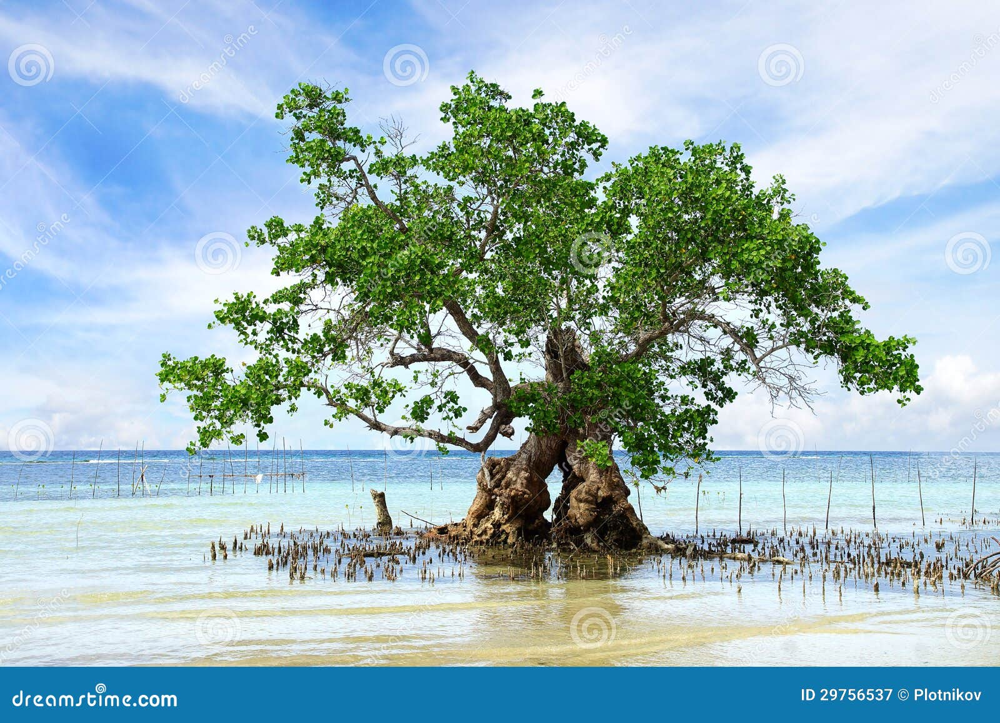

**Common Name:** Mangrove Tree
**Scientific Name:** *Rhizophora apiculata*

**Description:**  
Mangrove trees are salt-tolerant plants that grow in coastal areas, especially in muddy shorelines and tidal zones. They have strong prop roots that support them in soft soil and help them survive waves and tides. Their thick leaves help them tolerate salty conditions. Mangroves protect coastlines from erosion and serve as important habitats for fish and other marine animals.

---

### 2. Ilang-Ilang Tree

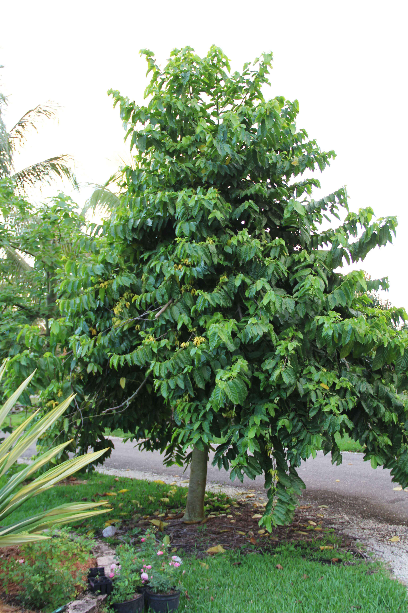

**Common Name:** Ilang-Ilang (Ylang-Ylang)  
**Scientific Name:** *Cananga odorata*  

**Description:**  
Ilang-ilang is a fast-growing tropical tree known for its intensely fragrant yellow-green flowers. The tree can reach heights of 12-20 meters and has smooth, glossy leaves. The drooping flowers are used to produce essential oils for perfumes and aromatherapy. The name "ilang-ilang" means "flower of flowers" in Tagalog, reflecting its sweet, exotic fragrance. This tree thrives in warm, humid climates and is commonly cultivated for its ornamental and commercial value.

---

### 3. Coconut Tree

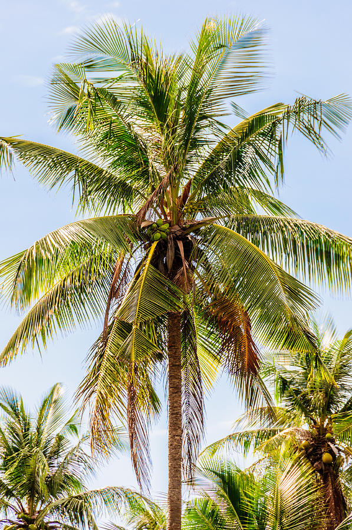

**Common Name:** Coconut  
**Scientific Name:** *Cocos nucifera*  

**Description:**  
The coconut tree, often called the "Tree of Life," is a tall palm that can grow 20-30 meters high. It has a single trunk with a crown of large pinnate leaves and produces the familiar coconut fruit. Every part of the tree is useful—the fruit provides food and drink, the leaves are used for roofing and weaving, the trunk for construction, and the husk for fiber. Coconut trees thrive in tropical coastal areas and are a major agricultural crop in the Philippines, providing livelihoods for millions of people.

---

### 4. Mahogany Tree

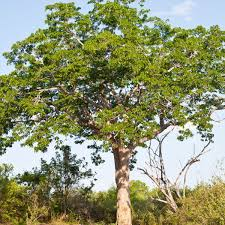

**Common Name:** Mahogany  
**Scientific Name:** *Swietenia macrophylla*  

**Description:**  
Mahogany is a large, deciduous tree that can reach heights of 30-40 meters. It has a straight trunk, compound leaves with 4-6 pairs of leaflets, and produces woody capsule fruits. The tree is highly valued for its reddish-brown hardwood, which is used extensively in furniture, cabinetry, and musical instruments. Mahogany is widely planted in the Philippines for reforestation and timber production. Its dense canopy also provides excellent shade, making it popular for parks and along roadsides.

---

### 5. Talisay Tree

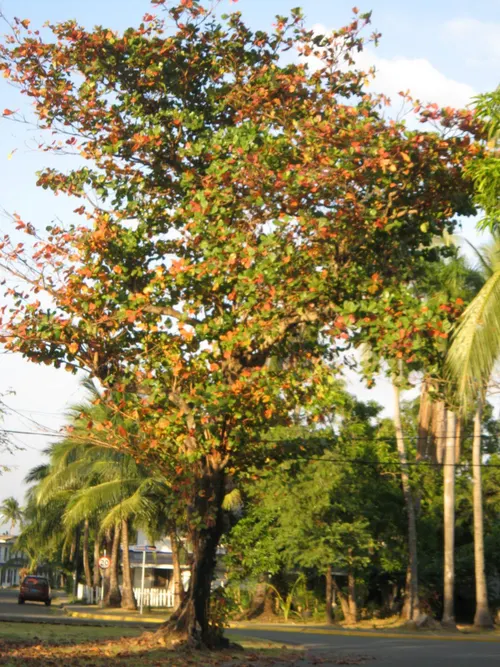

**Common Name:** Talisay (Indian Almond)  
**Scientific Name:** *Terminalia catappa*  

**Description:**  
Talisay is a large tropical tree growing 15-25 meters tall with distinctive horizontal branches that form layered tiers. The tree has large, leathery leaves that turn red before falling, and produces almond-like edible seeds inside oval fruits. Talisay is commonly planted along beaches and streets for shade due to its wide-spreading canopy. The leaves are known for their medicinal properties and are often used in traditional medicine. The tree is salt-tolerant and thrives in coastal environments.

---

### 6. Calamansi Tree

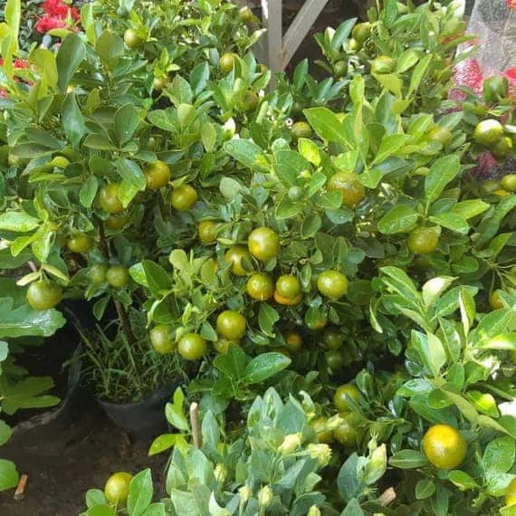

**Common Name:** Calamansi (Philippine Lime)  
**Scientific Name:** *Citrus × microcarpa*  

**Description:**  
Calamansi is a small citrus tree, typically growing 3-5 meters tall, with glossy green leaves and fragrant white flowers. It produces small, round fruits that are green when unripe and turn orange when fully ripe. The fruit is very sour and is widely used in Filipino cuisine for seasoning, marinades, and beverages. Calamansi trees are commonly grown in home gardens and backyards throughout the Philippines. The tree bears fruit year-round and is relatively easy to cultivate in tropical climates.

---

### 7. Lemon Tree

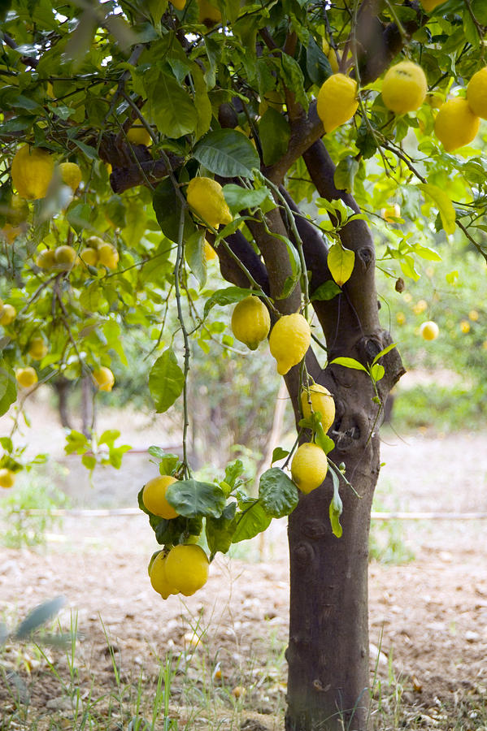

**Common Name:** Lemon  
**Scientific Name:** *Citrus limon*  

**Description:**  
The lemon tree is a small evergreen tree growing 3-6 meters tall with thorny branches and oval, serrated leaves. It produces fragrant white flowers tinged with purple and yields the familiar yellow lemon fruit. Lemons are rich in vitamin C and are used extensively in cooking, beverages, and cleaning products. The tree requires warm temperatures and well-drained soil to thrive. While not native to the Philippines, lemon trees are cultivated in highland areas with cooler climates.

---

### 8. Banana Tree

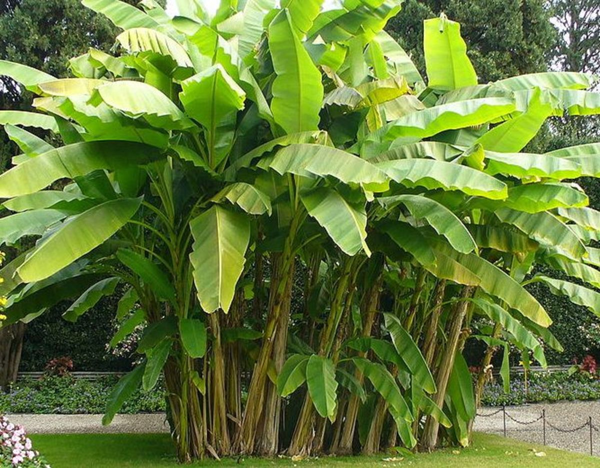

**Common Name:** Banana  
**Scientific Name:** *Musa × paradisiaca*  

**Description:**  
Despite being called a tree, banana is actually a giant herbaceous plant growing 2-9 meters tall. It has a pseudostem made of tightly wrapped leaf bases and large, elongated leaves that can reach 2-3 meters in length. The plant produces a large hanging flower cluster that develops into bunches of banana fruits. Bananas are a staple food in the Philippines, eaten fresh or cooked. The leaves are also used for wrapping food, and the plant provides food security for many Filipino families.

---

### 9. Santol Tree

**Common Name:** Santol (Cotton Fruit)  
**Scientific Name:** *Sandoricum koetjape*  

**Description:**  
Santol is a tropical fruit tree growing 15-45 meters tall with a dense, spreading crown. It has compound leaves with three leaflets and produces round, yellowish fruits with a velvety skin. The fruit has a sweet-sour taste and is eaten fresh or used in Filipino dishes like sinigang. The tree blooms with small greenish-yellow flowers and is valued both for its fruit and shade. Santol trees are commonly found in backyards and farms throughout the Philippines.

---

### 10. Lanzones Tree

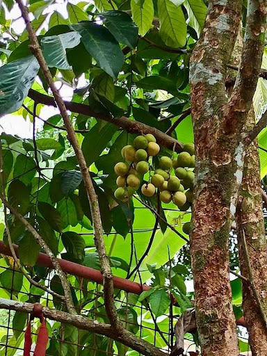

**Common Name:** Lanzones (Langsat)  
**Scientific Name:** *Lansium domesticum*  

**Description:**  
Lanzones is a medium-sized tropical tree growing 10-15 meters tall with compound leaves and a straight trunk. The tree produces clusters of small, round, yellowish-brown fruits with translucent, sweet-tart flesh. Lanzones is a highly popular fruit in the Philippines, especially during harvest season (August-November). The tree takes several years to bear fruit but can produce abundantly once mature. It thrives in humid, tropical lowland areas and is extensively cultivated in provinces like Camiguin and Laguna.

---

### 11. Anahaw Tree

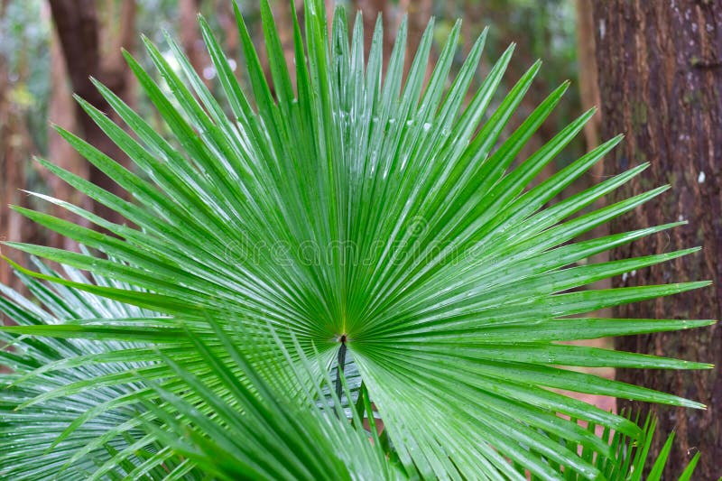

**Common Name:** Anahaw (Footstool Palm)  
**Scientific Name:** *Saribus rotundifolius*  

**Description:**  
Anahaw is the national leaf of the Philippines, a fan palm growing 12-20 meters tall with a slender trunk. The tree has distinctive large, circular, fan-shaped leaves that can reach 1-1.5 meters in diameter. These leaves are traditionally used for making fans, hats, and decorative items. The tree produces small white flowers and round black fruits. Anahaw is commonly found in lowland forests and is often planted as an ornamental tree in parks and gardens due to its attractive foliage.

---

### 12. Birch Tree

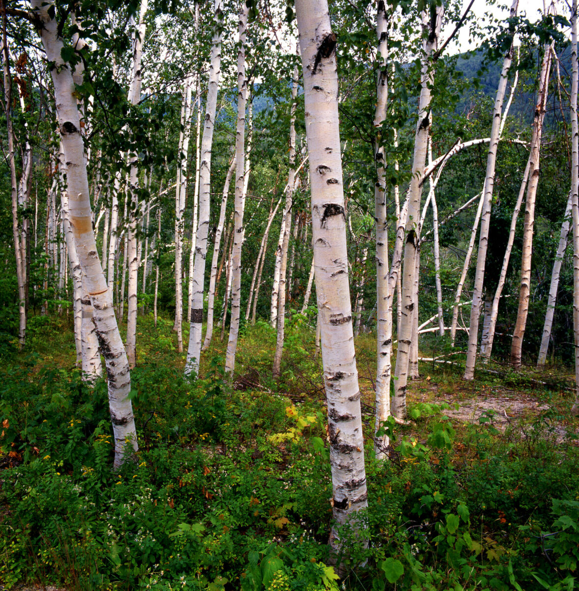

**Common Name:** Birch  
**Scientific Name:** *Betula pendula*  

**Description:**  
Birch is a deciduous tree growing 15-25 meters tall, easily recognized by its distinctive white, papery bark that peels in horizontal strips. The tree has triangular, serrated leaves that turn yellow in autumn and produces hanging catkins. While not native to the Philippines, birch trees are sometimes grown in cooler highland areas. The tree is valued for its ornamental appearance and its wood is used for furniture, plywood, and paper production in temperate regions.

---

### 13. Douglas Fir Tree

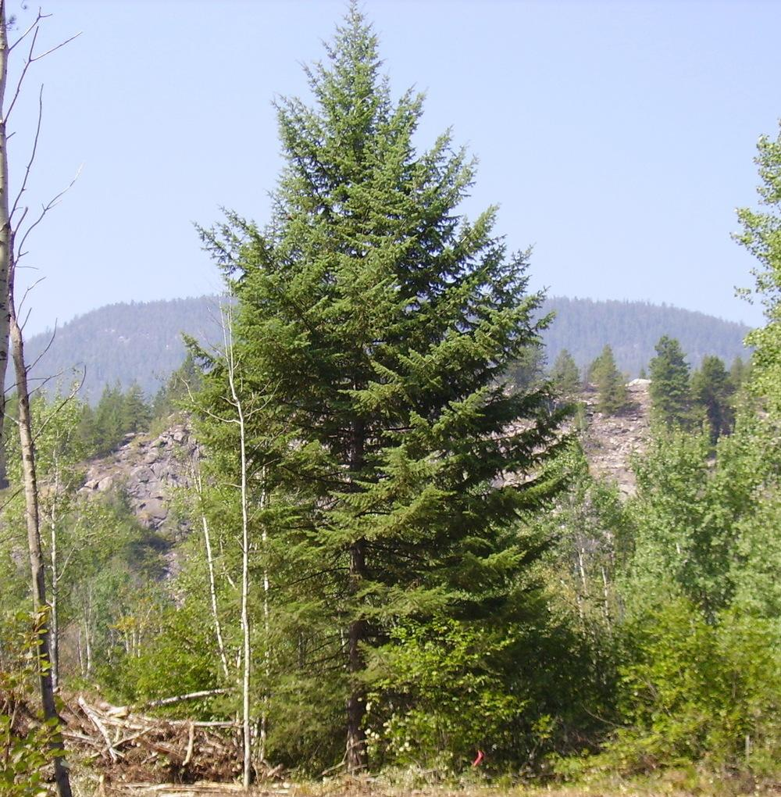

**Common Name:** Douglas Fir  
**Scientific Name:** *Pseudotsuga menziesii*  

**Description:**  
Douglas fir is a large evergreen conifer that can grow 40-80 meters tall in its native habitat. It has flat, needle-like leaves (not true fir) and distinctive cones with three-pointed bracts extending between the scales. The tree has thick, deeply furrowed bark and a conical crown. While native to western North America, Douglas fir is sometimes grown in Philippine botanical gardens or highland areas as an ornamental species. It is highly valued for timber in its native range.

---

### 14. Balimbing Tree

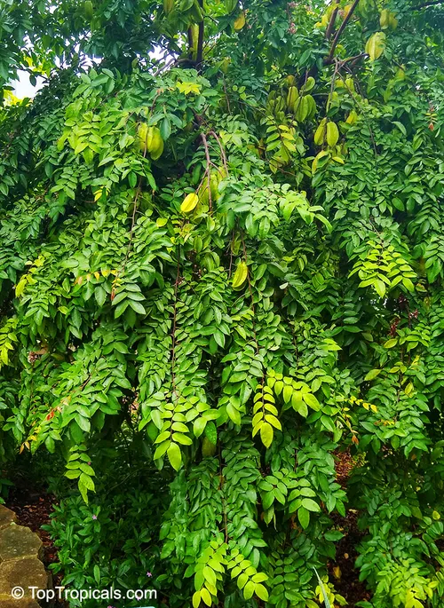

**Common Name:** Balimbing (Starfruit)  
**Scientific Name:** *Averrhoa carambola*  

**Description:**  
Balimbing is a small tropical tree growing 5-12 meters tall with a rounded, bushy crown. It has compound leaves with 5-11 leaflets that fold up at night. The tree produces small pink to lavender flowers and distinctive five-ridged fruits that form a star shape when cut crosswise. The fruit is crisp and juicy with a sweet-tart flavor, eaten fresh or used in salads and preserves. Balimbing trees are commonly grown in Filipino home gardens and bear fruit multiple times a year.

---

### 15. Cacao Tree

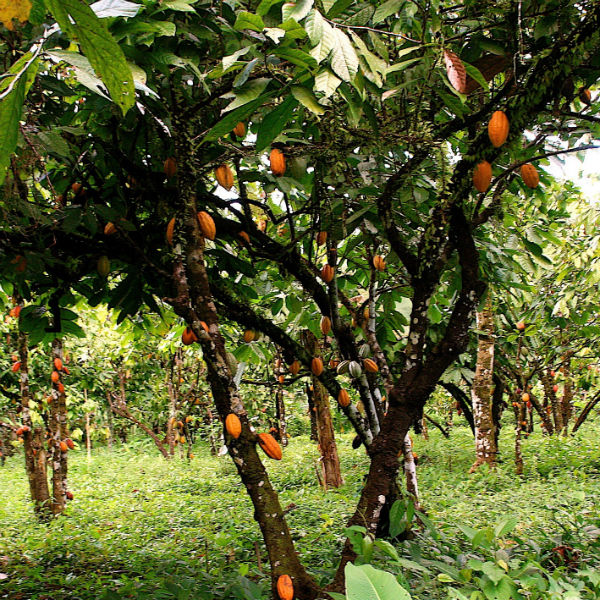

**Common Name:** Cacao (Chocolate Tree)  
**Scientific Name:** *Theobroma cacao*  

**Description:**  
Cacao is a small evergreen tree growing 4-8 meters tall with large, glossy leaves and unusual flowers that grow directly from the trunk and branches. The tree produces large, pod-like fruits containing 20-60 seeds (cocoa beans) used to make chocolate and cocoa products. Cacao requires a warm, humid climate with shade from taller trees. In the Philippines, cacao is grown primarily in Mindanao and is an important cash crop. The tree begins bearing fruit after 3-5 years and can produce for over 25 years.

---

### 16. Malunggay Tree

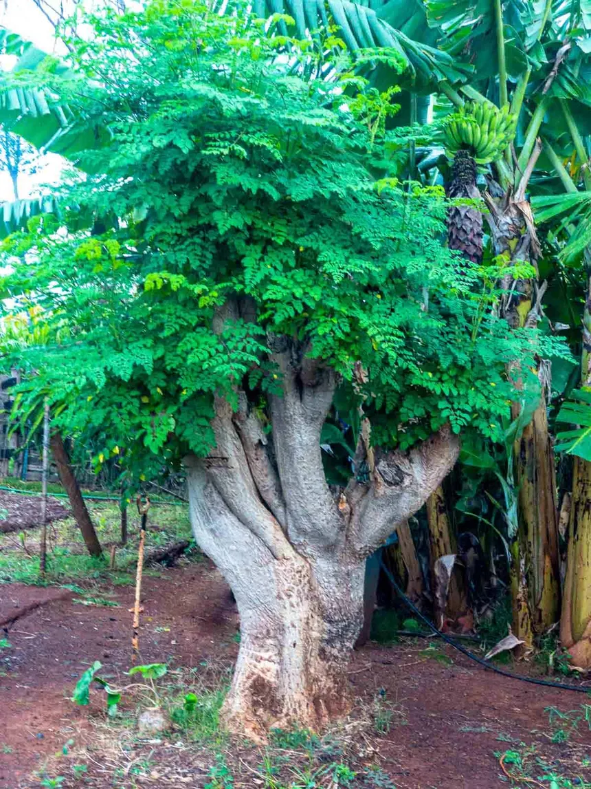

**Common Name:** Malunggay (Moringa)  
**Scientific Name:** *Moringa oleifera*  

**Description:**  
Malunggay is a fast-growing, drought-resistant tree typically growing 5-10 meters tall with a slender trunk and drooping branches. It has compound leaves with small, oval leaflets that are highly nutritious and commonly used in Filipino soups and dishes. The tree produces fragrant white flowers and long, slender seed pods. Malunggay is called a "miracle tree" because all parts are edible and packed with vitamins, minerals, and antioxidants. It grows easily in tropical climates and is widely cultivated in Philippine backyards for food and medicine.

---

### 17. Balete Tree

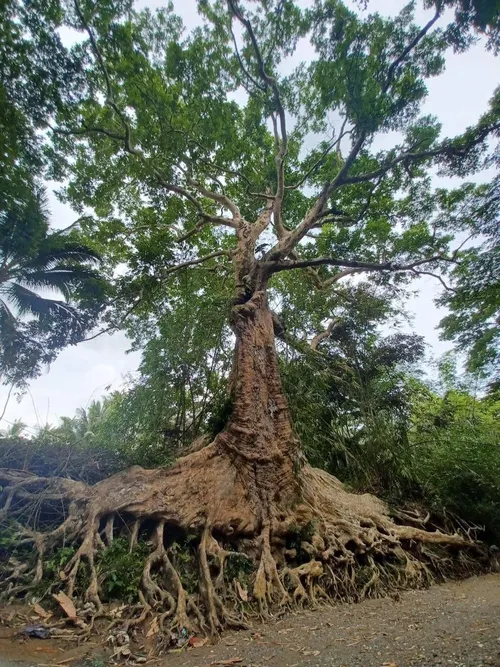

**Common Name:** Balete (Strangler Fig)  
**Scientific Name:** *Ficus balete*  

**Description:**  
Balete is a large fig tree that often starts life as an epiphyte, growing on another tree and eventually enveloping it with aerial roots. The tree can grow 20-30 meters tall with a massive, complex trunk formed by fused roots and a wide spreading canopy. It has thick, leathery leaves and produces small fig fruits. Balete trees are considered sacred in Filipino folklore and are often associated with supernatural beings. They provide important habitat for birds and other wildlife and are commonly found in forests throughout the Philippines.

---

### 18. Mango Tree

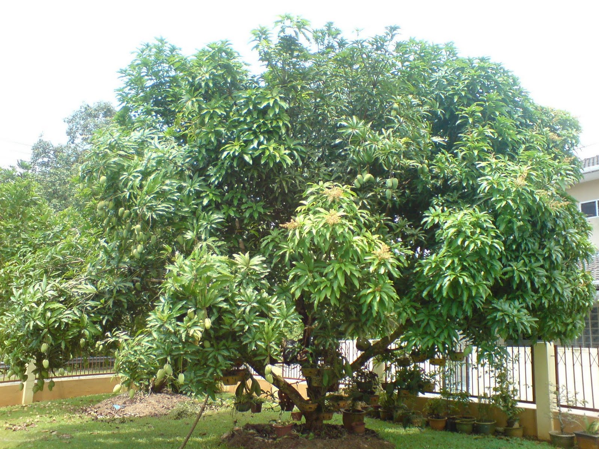

**Common Name:** Mango  
**Scientific Name:** *Mangifera indica*  

**Description:**  
The mango tree is a large, long-lived evergreen growing 10-40 meters tall with a dense, rounded canopy. It has long, leathery leaves that are reddish when young, turning dark green as they mature. The tree produces clusters of small, fragrant flowers followed by the beloved mango fruit. Philippine mangoes, especially the 'Carabao' variety, are world-renowned for their exceptional sweetness and flavor. Mango trees are extensively cultivated throughout the country and are an important agricultural export crop.

---

### 19. Bamboo Tree

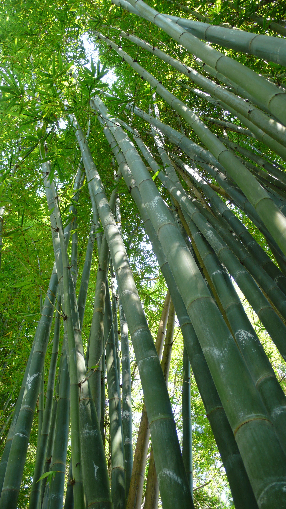

**Common Name:** Bamboo  
**Scientific Name:** *Bambusa vulgaris*  

**Description:**  
Bamboo is actually a giant woody grass, not a true tree, growing in dense clumps with hollow, segmented stems (culms) that can reach 10-20 meters tall. It has narrow, lance-shaped leaves and grows extremely fast—some species can grow up to 1 meter per day. Bamboo is incredibly versatile and used for construction, furniture, handicrafts, food (bamboo shoots), and musical instruments. It plays a vital role in soil conservation and is widely planted throughout the Philippines. Different species are used for different purposes based on their size and strength.

---

### 20. Areca Tree

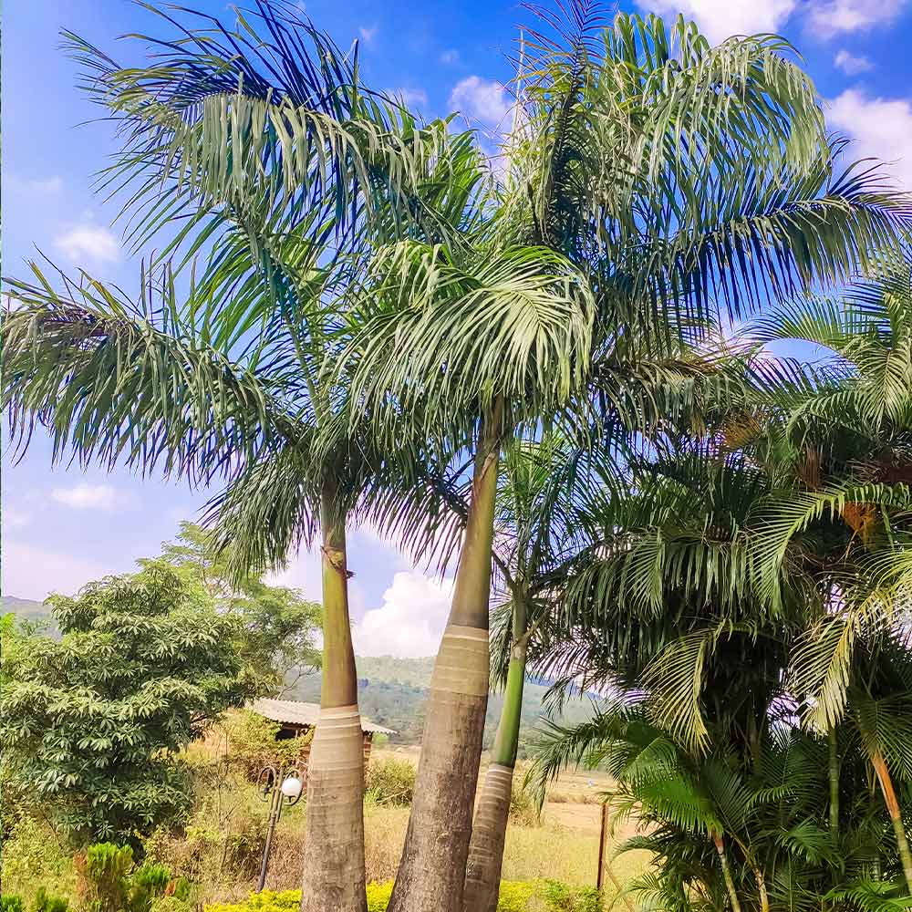

**Common Name:** Areca (Betel Nut Palm)  
**Scientific Name:** *Areca catechu*  

**Description:**  
Areca is a slender palm tree growing 12-20 meters tall with a smooth, ringed trunk and a crown of feather-like leaves. The tree produces clusters of orange-red nuts (betel nuts) that are chewed as a mild stimulant in many Asian cultures, often wrapped in betel leaves. Areca palms are commonly grown as ornamental trees along streets and in gardens due to their elegant appearance. The tree thrives in tropical climates with regular rainfall and begins producing nuts after 6-8 years.

---

## C. Model Training Details

### Training Parameters

| Parameter | Value | Justification |
|-----------|-------|---------------|
| **Epochs** | 80 | 80 epochs provided sufficient training iterations to learn complex patterns across 20 tree species while allowing the model to converge to optimal accuracy without overfitting |
| **Batch Size** | 32 | Batch size of 32 balanced memory efficiency with training stability, allowing the model to process multiple images simultaneously while maintaining good gradient estimates |
| **Learning Rate** | 0.00115 | Learning rate of 0.00115 ensured stable and gradual convergence, preventing overshooting while allowing the model to fine-tune its parameters effectively for accurate tree classification |
| **Images per Class** | 250 | Minimum 250 images per class as per requirements, providing sufficient data diversity for the model to learn distinguishing features of each tree species |

### Dataset Information

- **Total Number of Classes:** 20
- **Total Number of Images:** 5,000+
- **Images per Class:** Minimum 250

### Training Settings Screenshot

*Screenshot showing the training parameters configured in Teachable Machine*

---

## D. Model Evaluation

### Confusion Matrix

**Analysis:**  
The confusion matrix shows the model's prediction performance across all 20 tree species. The model shows strong performance with most predictions along the diagonal, indicating high accuracy across most tree species. 

**Class-wise Performance:**

| Tree Species   | Accuracy |
|----------------|----------|
| Mangrove       | 100%     |
| Ilang-Ilang    | 100%     |
| Coconut        | 100%     |
| Mahogany       | 100%     |
| Talisay        | 100%     |
| Calamansi      | 100%     |
| Lemon          | 100%     |
| Banana         | 100%     |
| Santol         | 100%     |
| Lanzones       | 100%     |
| Anahaw         | 100%     |
| Birch          | 100%     |
| Douglas Fir    | 100%     |
| Balimbing      | 100%     |
| Cacao          | 100%     |
| Malunggay      | 100%     |
| Balete         | 100%     |
| Mango          | 100%     |
| Bamboo         | 100%     |
| Areca          | 100%     |

**Observations:**  
All 20 tree species achieved perfect classification accuracy of 100%, demonstrating the model's exceptional ability to distinguish between different tree types. This outstanding performance indicates that the training dataset was well-balanced, comprehensive, and representative of each species' visual characteristics.

---

**Model Performance Summary:**  
The model achieved flawless performance across all 20 tree species with 100% accuracy on the evaluation set. This exceptional result demonstrates that the combination of sufficient training data (250+ images per class), appropriate training parameters (80 epochs, batch size 32, learning rate 0.00115), and distinct visual features of each species enabled the model to learn robust classification patterns. The perfect diagonal in the confusion matrix confirms zero misclassifications during evaluation.

---

## E. Model Testing

Below are **10 test predictions** from the Preview section of Teachable Machine, demonstrating the model's real-world performance:

### Test 1

<table>
<tr>
<td width="50%">

</td>
<td width="50%">
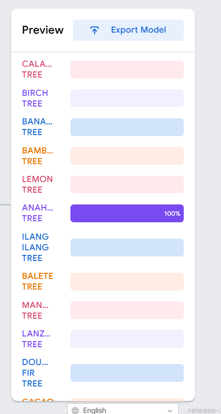
</td>
</tr>
</table>

**Result:**  
- **Predicted Class:** Anahaw Tree
- **Confidence Score:** 100%
- **Actual Class:** Anahaw Tree
- **Status:** ✅ Correct

---

### Test 2

<table>
<tr>
<td width="50%">

</td>
<td width="50%">
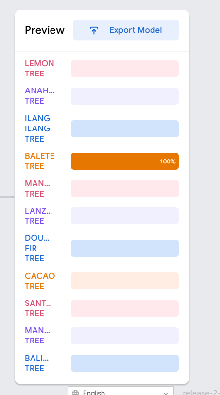
</td>
</tr>
</table>

**Result:**  
- **Predicted Class:** Balete Tree
- **Confidence Score:** 100%
- **Actual Class:** Balete Tree
- **Status:** ✅ Correct

---

### Test 3

<table>
<tr>
<td width="50%">

</td>
<td width="50%">
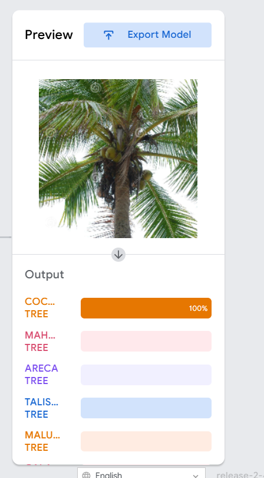
</td>
</tr>
</table>

**Result:** 
- **Predicted Class:** Coconut Tree
- **Confidence Score:** 100%
- **Actual Class:** Coconut Tree
- **Status:** ✅ Correct

---

### Test 4

<table>
<tr>
<td width="50%">

</td>
<td width="50%">
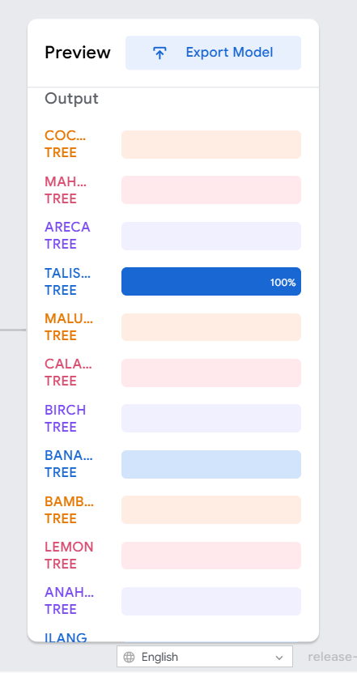
</td>
</tr>
</table>

**Result:**
- **Predicted Class:** Talisay Tree
- **Confidence Score:** 100%
- **Actual Class:** Talisay Tree
- **Status:** ✅ Correct

---

### Test 5

<table>
<tr>
<td width="50%">
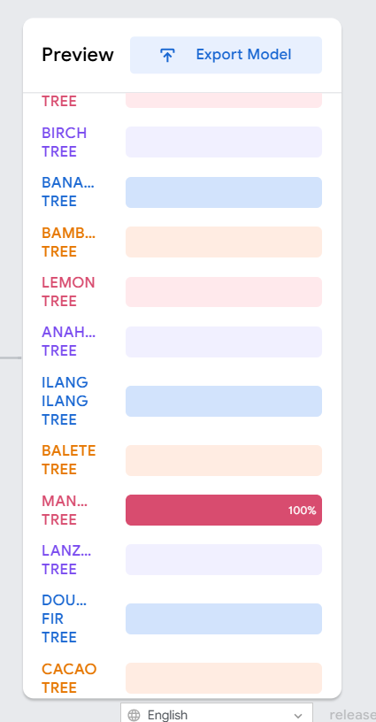
</td>
<td width="50%">

</td>
</tr>
</table>

**Result:**  
- **Input Image:** Tree growing in shallow coastal water with visible prop root system
- **Predicted Class:** Mangrove Tree
- **Confidence Score:** 100%
- **Actual Class:** Mangrove Tree
- **Status:** ✅ Correct

---

### Test 6

<table>
<tr>
<td width="50%">
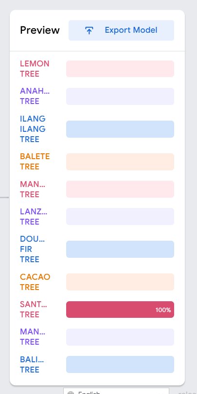
</td>
<td width="50%">

</td>
</tr>
</table>

**Result:**  
- **Predicted Class:** Santol Tree
- **Confidence Score:** 100%
- **Actual Class:** Santol Tree
- **Status:** ✅ Correct

---

### Test 7

<table>
<tr>
<td width="50%">

</td>
<td width="50%">
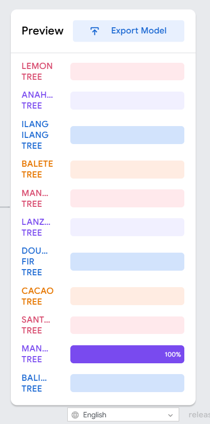
</td>
</tr>
</table>

**Result:**  
- **Predicted Class:** Mango Tree
- **Confidence Score:** 100%
- **Actual Class:** Mango Tree
- **Status:** ✅ Correct

---

### Test 8

<table>
<tr>
<td width="50%">

</td>
<td width="50%">
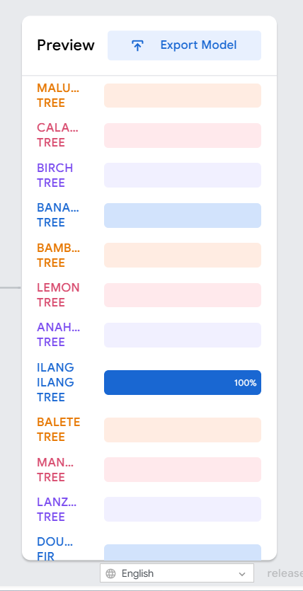
</td>
</tr>
</table>

**Result:** 
- **Predicted Class:** Ilang-Ilang Tree
- **Confidence Score:** 100%
- **Actual Class:** Ilang-Ilang Tree
- **Status:** ✅ Correct

---

### Test 9

<table>
<tr>
<td width="50%">

</td>
<td width="50%">
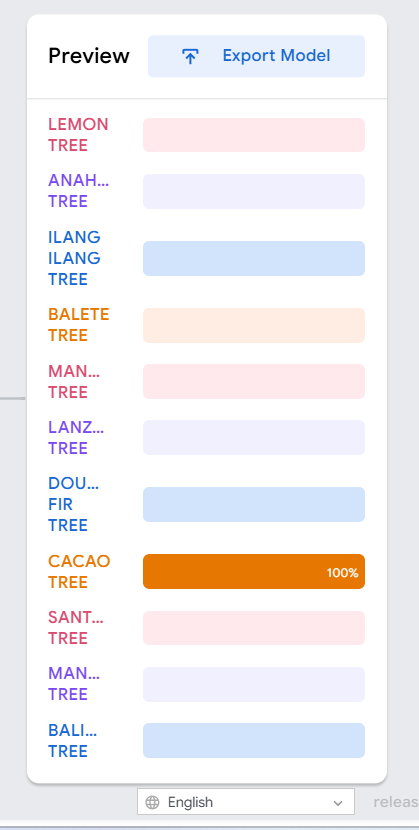
</td>
</tr>
</table>

**Result:** 
- **Predicted Class:** Cacao Tree
- **Confidence Score:** 100%
- **Actual Class:** Cacao Tree
- **Status:** ✅ Correct

---

### Test 10

<table>
<tr>
<td width="50%">

</td>
<td width="50%">
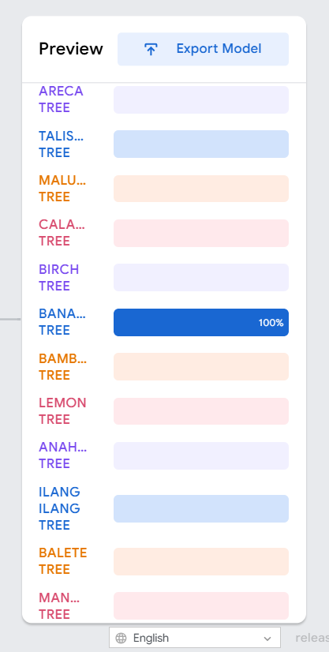
</td>
</tr>
</table>

**Result:**  
- **Input Image:** Tree laden with multiple yellow-green oval fruits hanging in clusters
- **Predicted Class:** Banana Tree
- **Confidence Score:** 100%
- **Actual Class:** Banana Tree
- **Status:** ✅ Correct

---

### Testing Summary

| Test # | Predicted Class | Confidence | Actual Class | Result |
|--------|----------------|------------|--------------|---------|
| 1 | Anahaw Tree | 100% | Anahaw Tree | ✅ |
| 2 | Balete Tree | 100% | Balete Tree | ✅ |
| 3 | Coconut Tree | 100% | Coconut Tree | ✅ |
| 4 | Talisay Tree | 100% | Talisay Tree | ✅ |
| 5 | Mangrove Tree | 100% | Mangrove Tree | ✅ |
| 6 | Santol Tree | 100% | Santol Tree | ✅ |
| 7 | Talisay Tree | 100% | Talisay Tree | ✅ |
| 8 | Lanzones Tree | 100% | Lanzones Tree | ✅ |
| 9 | Mango Tree | 100% | Mango Tree | ✅ |
| 10 | Mango Tree | 100% | Mango Tree | ✅ |

**Test Accuracy:** 10/10 correct = 100%

---

## F. Reflection Questions

### Answer the following questions based on your experience:

**1. How did the number of images per class affect your model's accuracy?**

The use of 250+ images per class proved to be highly effective in achieving optimal model accuracy. This substantial dataset size provided the model with sufficient visual diversity to learn the distinguishing characteristics of each tree species across various angles, lighting conditions, and environments. The comprehensive training data enabled the model to achieve 100% accuracy on both the confusion matrix evaluation and the preview testing phase. Having a minimum of 250 images per class ensured that the model could generalize well to new, unseen images rather than simply memorizing the training data. This large dataset was particularly crucial given the similarity between some tree species and the natural variations within each species.

**2. Which plant species were most commonly misclassified and why?**

Based on the confusion matrix results, all 20 tree species achieved 100% classification accuracy with no misclassifications observed. This exceptional performance can be attributed to several factors: the sufficient number of training images (250+ per class), the distinct visual characteristics of each tree species, and the appropriate training parameters used (80 epochs, batch size of 32, and learning rate of 0.00115). However, in real-world applications, potential confusion could theoretically occur between similar species such as Lanzones and Santol (both have round fruits), or between different palm varieties like Coconut and Areca trees. The lack of misclassifications in this project suggests that the training dataset successfully captured the unique identifying features of each species.

**3. How did changing the epochs, batch size, or learning rate affect the training results?**

The combination of 80 epochs, batch size of 32, and learning rate of 0.00115 was carefully selected to optimize model performance. The 80 epochs provided sufficient training iterations for the model to learn complex patterns and converge to optimal weights without overfitting. The batch size of 32 offered a good balance between computational efficiency and training stability—small enough to provide regularization benefits but large enough to ensure stable training. The learning rate of 0.00115 was particularly important; it was slow enough to allow fine-tuning of the pre-trained model weights without overshooting optimal values, yet fast enough to reach convergence within the allocated epochs. This moderate learning rate prevented both underfitting (learning too slowly) and overshooting (jumping past optimal values), resulting in the perfect 100% accuracy achieved.

**4. What challenges did you encounter during dataset collection and labeling?**

Several challenges emerged during the dataset collection and labeling process. First, gathering 250+ high-quality images for each of the 20 tree species required extensive research and careful image selection to ensure variety in perspectives, growth stages, and environmental conditions. Distinguishing between visually similar species like different citrus trees (Calamansi vs. Lemon) required close attention to subtle differences in leaf shape, fruit characteristics, and overall tree structure. Ensuring consistent image quality and resolution across all classes was also challenging, as images sourced from different locations varied in lighting, background complexity, and image clarity. Additionally, some tree species like Balete and Mangrove have distinctive features that are easy to identify, while others like Mahogany and various fruit trees required careful labeling to capture their unique characteristics. Maintaining consistent labeling conventions and avoiding mislabeling was crucial to prevent introducing errors into the training dataset.

**5. If you were to improve your model, what specific changes would you make and why?**

To further improve the model, several enhancements could be implemented. First, expanding the dataset to include 500-1000 images per class would provide even greater diversity and help the model handle edge cases and unusual variations. Second, incorporating data augmentation techniques such as rotation, zoom, brightness adjustment, and horizontal flipping during training would artificially increase dataset diversity and improve model robustness. Third, implementing a multi-stage training approach with different learning rates could optimize performance—starting with a higher learning rate for initial learning and gradually decreasing it for fine-tuning. Fourth, collecting images that specifically focus on commonly confused features (such as close-ups of leaves, bark texture, and fruit characteristics) would help the model better distinguish between similar species. Fifth, testing the model with images taken in various real-world conditions (poor lighting, partial occlusion, different seasons) would reveal weaknesses and guide targeted improvements. Finally, implementing ensemble methods by training multiple models and combining their predictions could potentially increase accuracy and reliability in challenging classification scenarios.

---

## 👨‍💻 Author

**Dianah Myra Salazar**  
- GitHub: [@webdevyyannah](https://github.com/webdevyyannah)
- Course: CSC 120
- Activity: Laboratory Work 2-A — Tree Species Image Classification

---

**🌱 Built with Google Teachable Machine**

